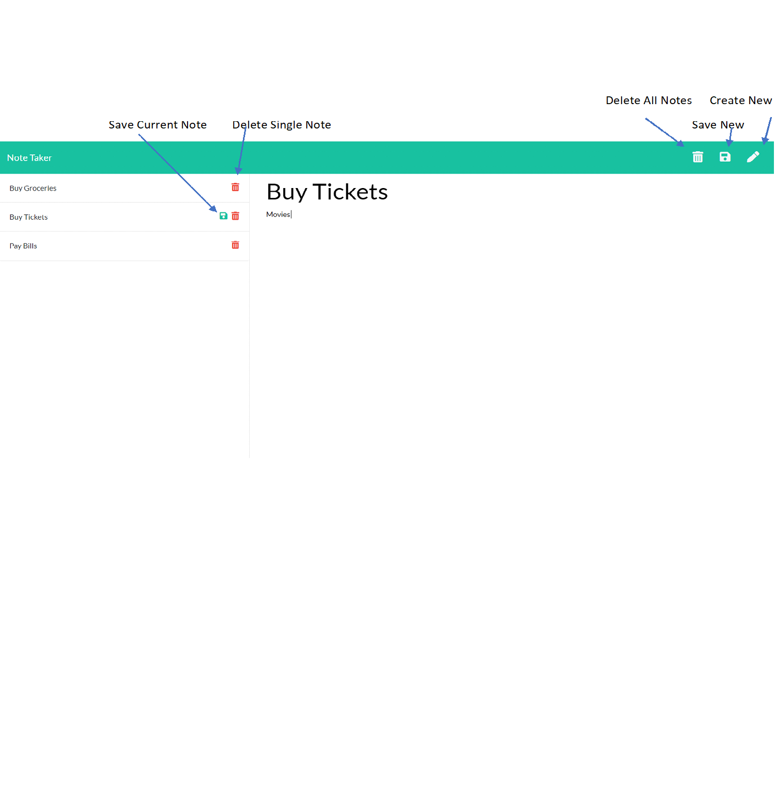

# Note Taker     
  ## 
<hr>  

  ## Table of Content
   1. [Description](#Description)
   2. [Link](#Link and Screenshot)
   3. [Installation](#Installation)
   4. [Usage](#Usage)
   5. [License](#License)
   6. [Contributing](#Contributing)
   7. [Learnings](#Learnings)
   8. [Questions](#Questions)  
   <br>

  ## Description <br>
  This is an app to write and save notes.
It might help small business owners or other individuals
to be able to write and save notes so that they can organize 
their thoughts and keep track of tasks that need to be completed.
<br>
  <br>

  ## Link and Screenshot <br>
  The deployed app is available in the below link. <br>
  [https://secret-plateau-96475.herokuapp.com/](https://secret-plateau-96475.herokuapp.com/) <br>
  Screenshot <br>
  

  ## Installation <br>
  Please follow the below steps:
Fork and clone the repository [note-taker](https://github.com/dassoumik/note-taker)

Load npm modules on your local repository folder you have to run following commands from your repository folder terminal

```node

 npm init --y
 npm i
 npm i express
 npm i body-parser
 npm i db-json
 npm i nodemon
 
```
Once you are done with installing npm packages, please enter following command on the terminal

```node

 node index.js

```
   OR

```node

 nodemon index.js

```

This will start the server and the port number {PORT} will be displyed on the terminal.
Now, you can open the browser and put address localhost:{PORT}.
This will open up the home page.

 <br>
  <br>

  ## Usage <br>
  This is an useful app to store user notes
to keep track of one's priorities, reminders or work due notes.
 <br>
  <br>

  ## License <br>
  This app follow **MIT** licensing rules. Please check below link for more details.
  You can also refer the LICENSE.txt file in the root folder. <br> <br>
  https://choosealicense.com/licenses/mit/ <br>
  <br>

  ## Contributing <br>
   - Fork it
 - Create your feature branch
 - Commit your changes
 - Push to the branch
 - Create a new Pull Request <br>
  <br>

  ## Learnings <br>
  The project gave exposure to learn important consepts 
of allround FULL STACK development. It opened the avenue of the true server side 
programming. It helped to form understanding on express and node.
Learnt the basics of get and post functionalities at the server side.
Other useful function that was used was delete and body-parser package. <br>
  <br>

  ## Questions <br>
  Please connnect with me at: <br> contact.soumikdas@gmail.com <br> <br>
  Please also follow my github at the below link: <br>
      [Soumik Das](https://github.com/dassoumik)  

